To execute imageDisplayer:

1) Go in the out folder

2)g++ -W -Wall -pedantic -o main -p apps/imageDisplayer/imageDisplayer.cpp -lstdc++fs -lopencv_highgui -lopencv_imgcodecs -lopencv_core

3)Execute ./main

# Yocto/PathExtension: On Histogram-preserving Blending for Randomized Texture Tiling
 **Riccard Gozzovelli - 1849977**

In this project we will present a possible implementation of how Texture Synthesis can be achieved for the Yocto/GL library. The main reference paper used is the one proposed by the [Walt Disney Animation Studios](http://www.jcgt.org/published/0008/04/02/paper.pdf) in 2019 which in turn, tried to enhance the already good results obtained by [Heitz and Neyret](https://hal.inria.fr/hal-01824773) in 2018.

We will provide first a small introduction about what Texture Synthesis is and how it can be effectively confronted. We will then illustrate our implementation and the results obtained with the help of some images.

## Introduction
Texture mapping is that method that allows to map the pixels of a texture to a 3D surface. Independently from the available resources, being able to create highly realistic scenes with many elements and high-resolution textures is always very difficult. Most of the time infact, textures are hand-painted and therefore small in size. If not properly handled, it will be possible to notice every single patch of the original texture applied to the object. To avoid this effect many techniques have been developed, combine two or multiple layers of the same texture with slight offsets, use random noise function to obtain different patterns or resynthesize similar looking textures. In any case we always look for methods that are fast and that can produce photo-realistic results.

Texture Synthesis is another possible method involved in generating large images starting from small ones. *Perlin* or *Worley* noise are probably the oldest methods that tried to achieve procedural textures by exploiting **noise functions**. But using those methods for real-time renderings it's a very bad choiche since their speed perfomances are very poor. That's why in 2018, Eric Heitz and Fabrice Neyret proposed a novel way to generate good-looking large texture in a very short time. One year later this method was enhanced to make it more efficient (faster and less memory demanding) but also to address different needs like handling high-resolution textures (4096x4096) and grayscale textures.

### Implementation
The way in which this method is implemented is straight-forward. It consists of two main operations:

- Texture Gaussianization
- Histogram-preserving blending

Both of these operations are the same that were introduced in the original paper but with some relevant differences. 

#### TEXTURE GAUSSIANIZATION
The first step of the method is to gaussianize the texture immediately after having loaded it. The result that we want to obtain is a 1D lookup table (**1D LUT**), one per channel, that can be used to define a mapping between the original and the gaussianized value of each texel, and viceversa. Notably:
 - to pass from original to gaussian values we transform each texel through the CDF of the input histogram to produce a uniform distribution and then we compute the inverse CDF of it;
 - to pass from gaussian to original values we compute the *direct* CDF of the input histogram's uniform distribution.

Therefore the informations that we want to store inside the Texture struct (defined inside *yocto_pathrace.h*) are the input histograms, one per channel, and the gaussianized image (that we call *LUT*).
The full algorithm starts at line 2147 (*yocto_pathtrace.cpp*) and it is implemented as follows:

- Check whether the image colors are represented in a floating point or a byte representation. In the latter case convert each byte to the correspondent float. Use these temporary values to initialize the attribute *LUT* of the Texture struct.

- Flatten the image passing from an *image<vec3f>* representation to a simple one dimensional array.

- Loop over each element of the array, normalize the value in the range [0, 255] so as to use the value as an index for the corresponding *histogram_X* ( with X = {R,G,B} ) array and update the number of occurences for that index.

- Loop over the elements in *histogram_X* and update the value of each element *i* as the sum of the current with the previous one *i-1*. Assign the *histogram_X* arrays to the corresponding attribute of the Texture struct.

- Initialize three 1D LUTs and fill them with the result of the inverse CDF of the input histograms for every element.

- Update the LUT attribute of the Texture struct with the new values and reconstruct the original image shape. 

The idea behind texture gaussianization is to make the histogram's channels of the image to follow a gaussian distribution. This will come in handy for the next step since it should prevent the blending operation to produce unwanted color artifacts. Here are some examples, obtained at the end of this first step:

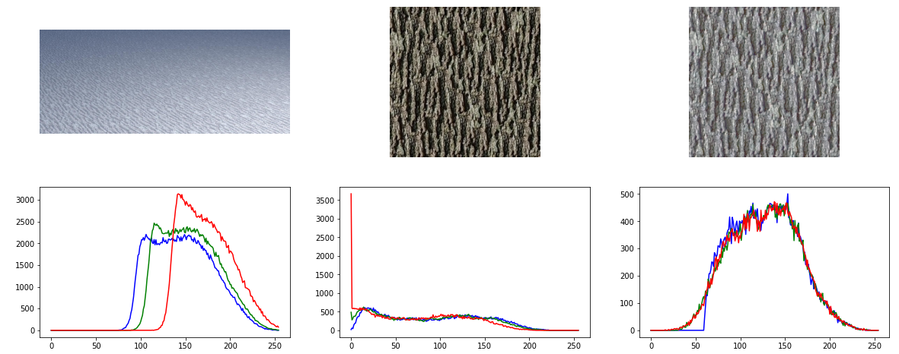

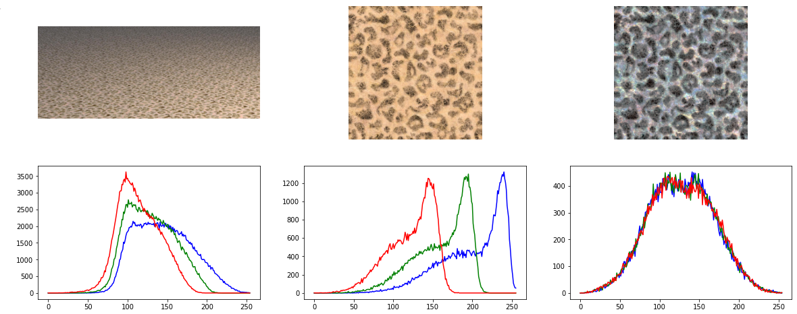

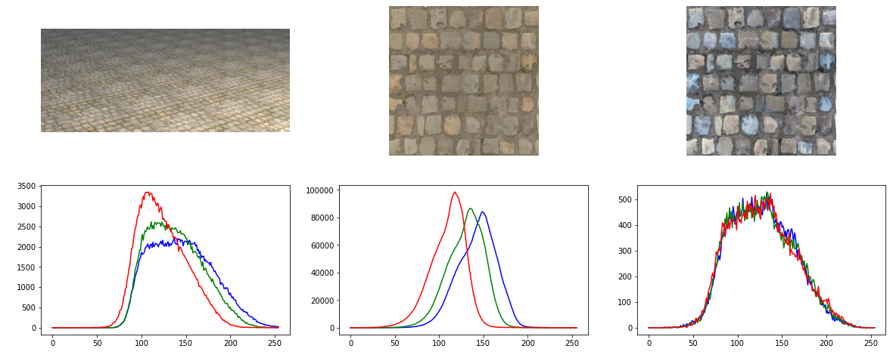

From left to right we have:
- The first image is the one obtained with the Yocto/GL implementation of the previous algorithm. It is possible to notice two things. The first one is that the patches of the original texture can be easily detected. The second is that the channels' histograms are gaussian but not all at the same level. We are sure that this is due to the presence of two area-lights in the scene that modify the value of all the pixels hit by them.
- The second image is the original texture used. Notice that the channels' histograms are not gaussian at all. 
- The third image was produced in order to prove that the first image is correct. These images are infact obtained in the same identical way to the original but without applying them to an object.

We conclude by pointing out that in the main reference paper, the texture gaussianization is applied only on one channel rather than in all of three.

#### Histogram-preserving blending
The second step of the method consists of adopting a random tiling procedure before blending the texels together. The random tiling procedure uses an equilater-triangle lattice in such a way to obtain a triangle grid. Given a point in the uv space, we can compute the local triangle to which it belongs and the barycentric coordinates inside of it. This will guarantee that each point is always covered by three tiles. A visual example of what we want to achieve is the following:

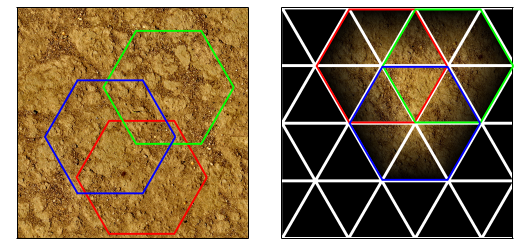

To provide randomness, the vertices of the triangle in the grid are altered by a small offset. The full algorithm starts at line 270 and works in this way:

- For a given point in the uv space we initialize the vertices of the triangles in which it is contained and the local barycentric coordinates.

- The function **TriangleGrid** is called and will compute the vertices of the triangles and the barycentric coordinates.
    * The uv point is scaled by a factor 2*sqrt(3) which controls the height of the hexagonal tiles. Lower values will capture more large-scale features but it might procedure texture repetition effects. Greater values will instead increase the variety of the tiles but might miss large-scale features.

    * The triangle grid is then created and the triangle vertices and barycentric coordinates are computed.

- The triangle vertices are then modified by a random offset thanks to the function **hash**.

- The input texture is fetched three times (I1,I2,I3) using the exact same procedure originally used in the **eval_texture** function.

The only step left is the blending part. Using simple linear blending: *I = w1I1 + w2I2 + w3I3* (with w1,w2,w3 barycentric coordinates) will not produce optimal results:

Normal tiling                     |  Randomized tiling
:--------------------------------:|:-------------------------:
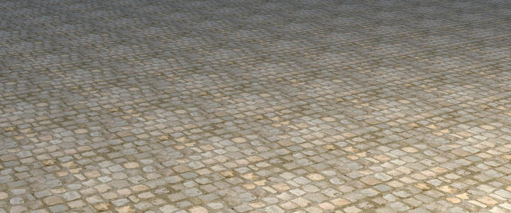  |  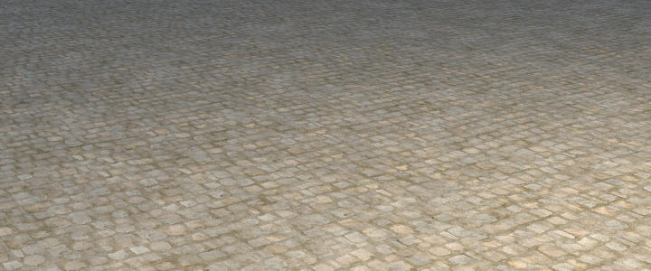
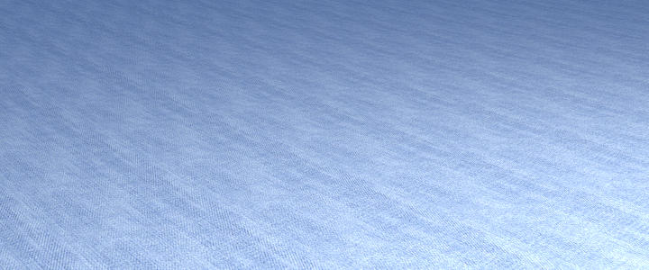  |  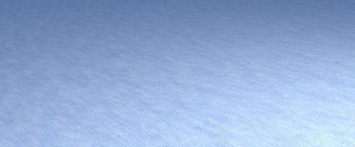
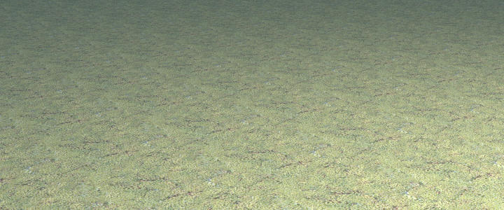  |  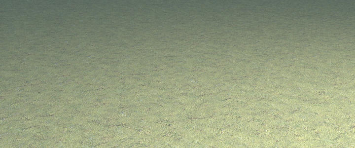
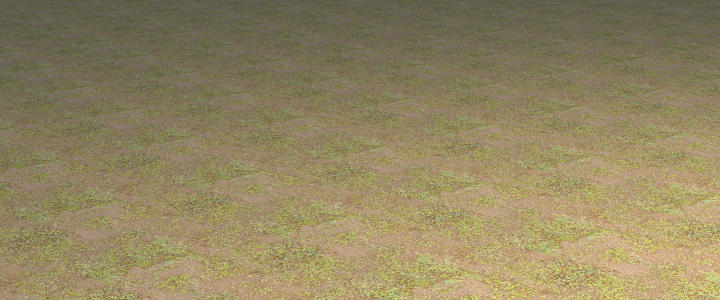  |  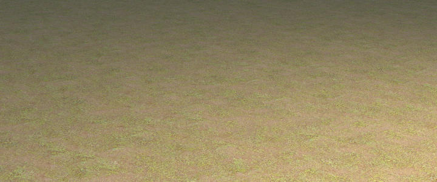

Texture repetitions are not visible anymore but some very strong ghosting effects are present, in particular for the first and the fourth image, but also heterogeneous contranst. To solve both this problems we add to the previous algorithm the following steps:

- Before linearly blending the three texture point, exponentiate the barycentric coordinates with a value of **γ**. A good value for it proved to be γ=4.

- After having blended the values, restore contrast with the function **compute_contrast_perchannel**.

- As a last step restore the original histogram distribution of the image by inverting the LUT mapping.

The final results obtained are the following:

## Submission

To submit the homework, you need to pack a ZIP file that contains all the code
you wrote, a readme file, all scenes and images you generated.
**Both people in the group should submit the same material.**
The file should be called `<lastname>_<firstname>_<studentid>.zip` 
(`<cognome>_<nome>_<matricola>.zip`) and you should exclude 
all other directories. Send it on Google Classroom.
 