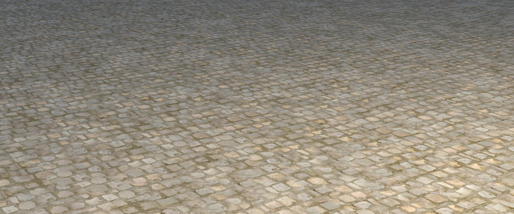
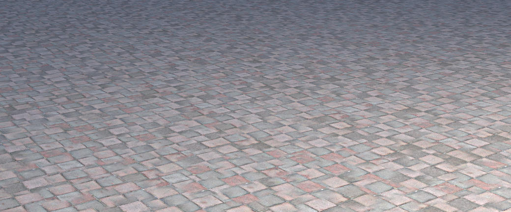
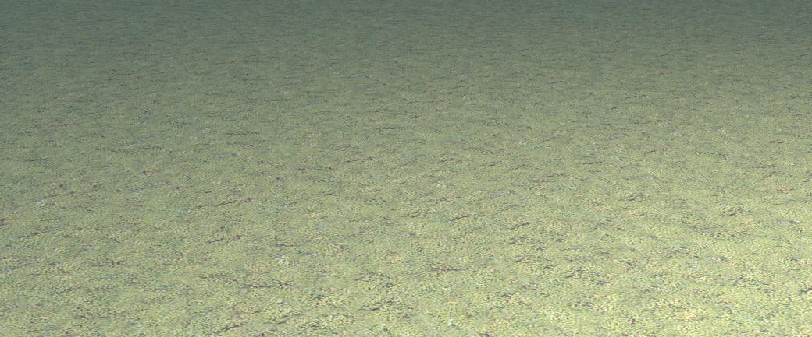
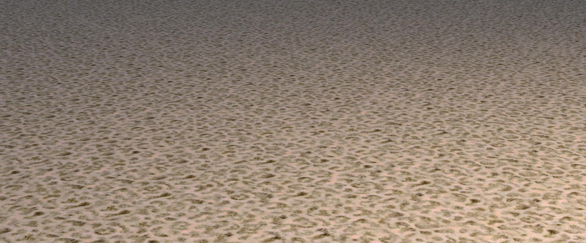

# Yocto/PathExtension: On Histogram-preserving Blending for Randomized Texture Tiling
## Riccard Gozzovelli - 1849977

In this project we will present an extension for the Yocto/GL library regarding a possible implementation for **Texture Synthesis**. The main reference paper used is the one proposed by the [Walt Disney Animation Studios](http://www.jcgt.org/published/0008/04/02/paper.pdf) in 2019 which in turn, tried to enhance the already good results obtained by [Heitz and Neyret](https://hal.inria.fr/hal-01824773) in 2018.

We will provide first a small introduction about what Texture Synthesis is and how it can be effectively achieved. We will then illustrate our implementation and the results obtained with the help of some images.

## Introduction
Texture mapping is that method that allows to map the pixels of a texture to a 3D surface. Independently from the available resources, being able to create highly realistic scenes with many elements and high-resolution textures is always very difficult. Most of the time infact, textures are hand-painted and therefore small in size. If not properly handled, it will be possible to notice the single patch of the original texture applied to the object. To avoid this effect many techniques have been developed, for instance combining two or multiple layers of the same texture with slight offsets, use random noise function to obtain different patterns or resynthesize similar looking textures. In any case we always look for methods that are fast and that can produce photo-realistic results.

Texture Synthesis is another possible method which consists of generating large images starting from small ones. *Perlin* or *Worley* noise are probably the oldest methods that tried to achieve procedural textures by exploiting **noise functions**. Using those methods for real-time renderings it's a very bad choiche since their speed perfomances are very poor. That's why in 2018, Eric Heitz and Fabrice Neyret proposed a novel way to generate good-looking large textures in a very short time. One year later this method was enhanced to make it more efficient (faster and less memory demanding) but also to address different needs like handling high-resolution textures (4096x4096) and grayscale textures.

### Implementation
The way in which this method is implemented is straight-forward. It consists of two main operations:

- Texture Gaussianization
- Histogram-preserving blending

Both of these operations are the same that were introduced in the original paper but with some relevant differences. 

#### TEXTURE GAUSSIANIZATION
The first step of the method is to gaussianize the texture immediately after having loaded it. The result that we want to obtain is a 1D lookup table (**1D LUT**), one per channel, that can be used to define a mapping between the original and the gaussianized value of each texel, and viceversa. Notably:
 - to pass from original to gaussian values we transform each texel through the CDF of the input histogram to produce a uniform distribution and then we compute the inverse CDF of it;
 - to pass from gaussian to original values we invert the previous computation.

Therefore the informations that we want to store inside the Texture struct (defined inside *yocto_extension.h*) are the mappings between transformed values, one per channel, and the gaussianized image (that we will call *LUT*). The formers are stored as map structures, the key of each map is the gaussianized color of the texture in range [0,255] while the value is the original texel value. 
The full algorithm starts at line 21 (*yocto_extension.cpp*) and it is implemented as follows:

- Check whether the image colors are represented in a floating point or a byte representation. In the latter case convert each byte to the correspondent float. Use these temporary values to initialize the attribute *LUT* of the Texture struct.

- Flatten the image passing from an *image<vec3f>* representation to a simple one dimensional array.

- For each element of the array, normalize the value in the range [0, 255] so as to use the value as an index for the corresponding *histogram_X* ( with X = {R,G,B} ) array and update the number of occurences for that index.

- Loop over the elements in *histogram_X* and update the value of each element *i* as the sum of the current with the previous one *i-1*.

- Initialize six one-dimensional vectors. The first three (*lutF_X*) will be filled with the result of the inverse CDF of the input histograms for every element. The other three (*lutI_X*) instead will contain the associated normalized value in the range [0,255].

- Build the mapping between normalized and original values and store the gaussianized values for the new image. 

- Reshape the flattened image to the correct shape and assign it to the *LUT* attribute of the texture.

The idea behind texture gaussianization is to make the histogram's channels of the image to follow a gaussian distribution. This will come in handy for the next step since it should prevent the blending operation to produce unwanted color artifacts. Here are some examples, obtained at the end of this first step:


From left to right we have:
- The first image is the one obtained with the Yocto/GL extension of the previous algorithm. It is possible to notice two things. The first one is that the patches of the original texture can be still easily detected. The second is that the channels' histograms are gaussian but not all at the same level. We are sure that this is due to the presence of the area-lights and the sky in the scene that modify the values of the pixels.
- The second image is the original texture used. Notice that the channels' histograms are not gaussian at all. 
- The third image was produced in order to prove that the first image is correct. These images are infact obtained with the same exact procedure of the original but without applying them to an object.

We conclude by pointing out that we used a *Truncated Gaussian Distribution* as described in the main reference paper in order to avoid possible clipping artifacts. The Truncated Gaussian Distribution is defined only in the range [0,1] and not [-inf, +inf] as the typical Gaussian Distribution.

#### Histogram-preserving blending
The second step of the method consists of adopting a random tiling procedure before blending the texels together. The random tiling procedure uses an equilater-triangle lattice in such a way to obtain a triangle grid. Given a point in the uv space, we can compute the local triangle to which it belongs and the barycentric coordinates of the triangle. This will guarantee that each point is always covered by three tiles. A visual example of what we want to achieve is the following:


To provide randomness, the vertices of the triangle in the grid are altered by a small offset. The full algorithm starts at line 270 and works in this way:

- For a given point in the uv space we initialize the vertices of the triangle in which it is contained and the local barycentric coordinates.

- The function **TriangleGrid** is called and it will compute the vertices of the triangles and the barycentric coordinates.
    * The uv point is scaled by a factor 2*sqrt(3) which controls the height of the hexagonal tiles. Lower values will capture more large-scale features but it might profuce texture repetition effects. Greater values will instead increase the variety of the tiles but might miss large-scale features.

    * The triangle grid is then created and the triangle vertices together with barycentric coordinates are computed.

- The triangle vertices are then modified by a random offset thanks to the **hash** function.

- The input texture is fetched three times (I<sub>1</sub>,I<sub>2</sub>,I<sub>3</sub>) using the exact same procedure originally used in the **eval_texture** function.

The only step left is the blending part. Using simple linear blending: *I = w<sub>1</sub>I<sub>1</sub> + w<sub>2</sub>I<sub>2</sub> + w<sub>3</sub>I<sub>3</sub>* (with w<sub>1</sub>,w<sub>2</sub>,w<sub>3</sub> barycentric coordinates) will not produce optimal results:

Normal tiling                     |  Randomized tiling
:--------------------------------:|:-------------------------:
  |  
  |  
  |  
  |  

Texture repetitions are not visible anymore but some very strong ghosting effects are present, in particular for the first and the fourth image, and it is also possible to notice that the contrast is heterogeneous. To solve the first problem we add the following step:

- Before linearly blending the three texture point, exponentiate the barycentric coordinates with a value of **γ**. A good value for it proved to be γ=4. This is particular useful for textures that present defined pattern, like the first image, which are not completely stochastics.

For the contrast problem we will had to implement the operations for contrast and histogram restoration. Unfortunately we had some problems that we were not able to fix. In particular:

- When contrast restoration was applied to stochastic textures, the hexagonal pattern produced by the random tiling procedure showed up.

- Histogram restoration instead completely changed the colors of each pixel producing completely wrong scenes.

Therefore we preferred to avoid the use of these two operations even though they are present in code. With this in mind the final results obtained are these:

Starting Texture                                      |  Final scene
:----------------------------------------------------:|:--------------------------------------------:
           | 
           | 
 | 
         | 
             | 
         | 
               | 
                 | 
               | 

As a whole, it is very easy to notice that the absence of the contrast restoration produced less vivid colors for all the images. If we instead analyze each image more in depth we see that:
- The first image, if compared with the one in the previous section, has now much more visible tiles' boundaries.
- The second image instead has still many problems (ghosting, wrong blending, irregular shape of tiles) but we are pretty confident that this is due to the texture itself. Indeed, the same identical problems are present also in the implementation by [Benedikt Bitterli](https://benedikt-bitterli.me/histogram-tiling/). Loading the exact same texture will provide the same problems.
- For all the other remaining images, except for the contrast, they seems to us to be somehow acceptable.

We conclude by stating that the time required to gaussianize each texture ranged from 77ms (textures of size 256x256) to 812ms (textures of size 2048x2048). The hardware used is very old and in particular not appropiate for these type of operations, hence we believe that these numbers might be much lower.

## Image Displayer
The last part of the project consisted in implementing something that allow the user to visualize the results obtained in almost the same fashion that Benedikt Bitterly used in his implementation. We created a very simple interface using OpenCV. The application, which can be found in the folder *apps/imageDisplayer*, checks whether the images to show are present or not. In the former case, each image is opened and the user can go to the next one, or to the previous one using arrow commands. In the latter case, the program ends. We point out the fact that the **name of each image must be hardcoded** inside *imageDisplayer.cpp*. The program must be compiled by providing the required OpenCV libraries plus the **lstdc++fs** library used to extract the current path. Hence, to execute the image displayer it is required to:

```
1)Go in the out folder

2)Execute on terminal the command  $g++ -W -Wall -pedantic -o main -p apps/imageDisplayer/imageDisplayer.cpp -lstdc++fs -lopencv_highgui -lopencv_imgcodecs -lopencv_core

3)Execute the output as $./main 

OPTIONAL) It might be required to also execute the following command $export MESA_GL_VERSION_OVERRIDE=3.3  in case of related errors.
```